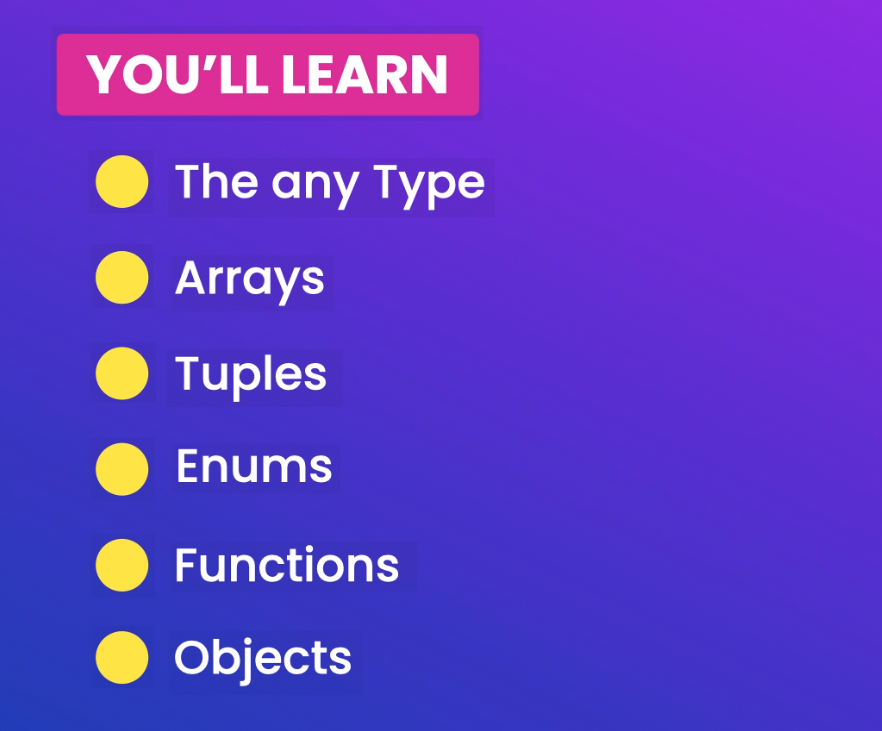
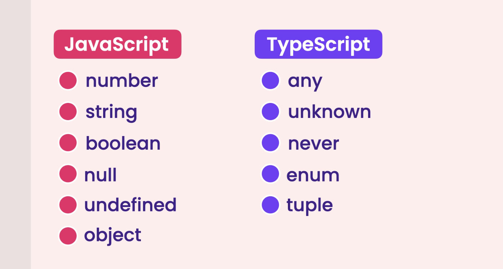
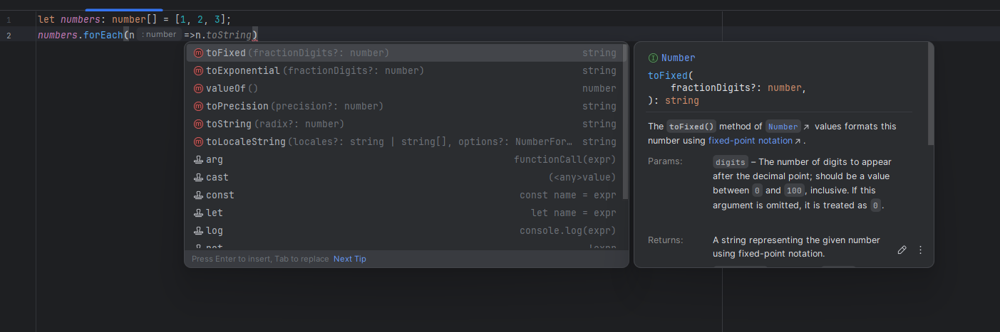
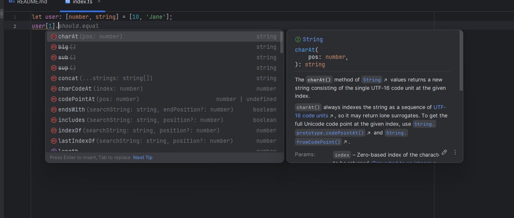
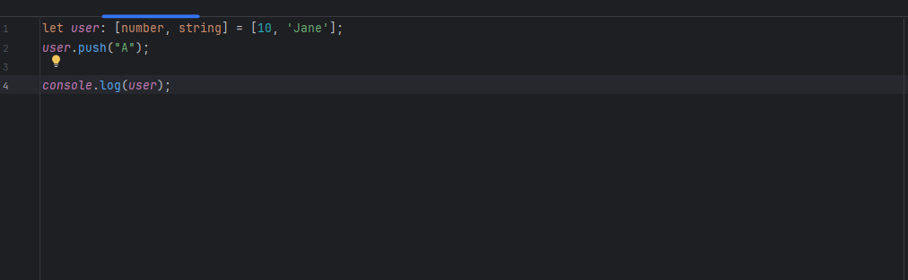
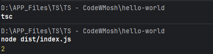
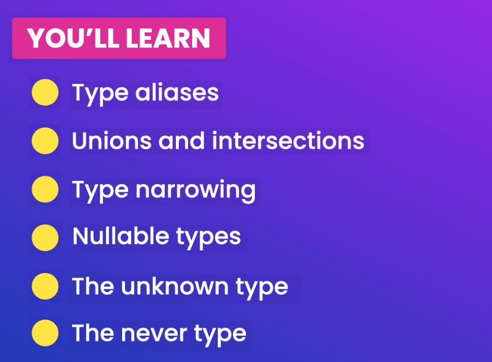
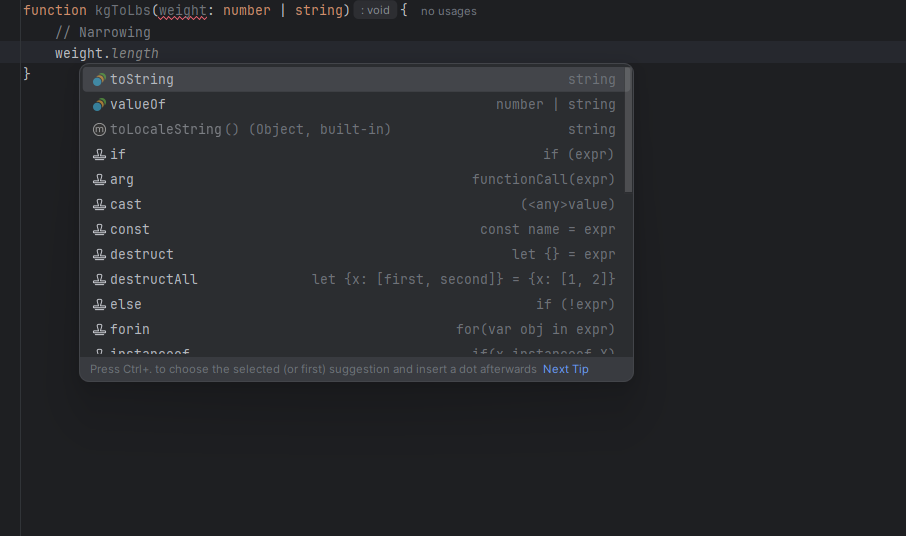

# TypeScript

TypeScript is built top on JavaScript.

In a nutshell, JavaScript with Type Checking.

Benefits

-   Static Typing
-   Code Completion
-   Refactoring
-   Shorthand notation

Drawbacks

-   Compilation
    -   ts -> compiler -> js
    -   (Transpilation)
-   Discipline in coding

TS = Medium to Large Projects
JS = Simple Projects

#### Installation

```bash
npm install -g typescript
```

#### Verify Installation

```bash
tsc -v
```

#### Config the typescript

```bash
tsc --init
```

**Ctrl + space --> Suggestions in the code.**

-   Useful when we use VS Code.
    -   Separate the source code and the compiled code.

```
"rootDir": "./src",                                  /* Specify the root folder within your source files. */
"outDir": "./dist",                                   /* Specify an output folder for all emitted files. */
"noEmitOnError": true,                            /* Disable emitting files if any type checking errors are reported. */ - Will not compile JS file if any error is there.
"removeComments": true,                           /* Disable emitting comments. */ -- rm comments from the compiled file.

```

```json
//Launch.json for debug for VSCode

"preLaunchTask" : "tsc: build - tsconfig.json"
"sourceMap": true /* Create source map files for emitted JavaScript files. */,

```

```typescript
let age: number = 10;
if (age < 50) age += 10;
console.log(age);

// Debug the console
```

# Fundamentals


## Built-in Types



No need to infer the type of the variable. It will automatically infer the type of the variable.

```typescript
let sales = 123_456_789; // sales: number
let course = "TypeScript"; // course: string
let is_published = true; // is_published: boolean
```

### Any types

```typescript
let level;
level = "beginner";
level = 1;

// Actually it is not a good practice to use any type. it's almost against the purpose of using TypeScript.
```

```typescript
function render(doc: any) {
    console.log(doc);
}

// If you know what type of data you are going to get, then you can use any type. Otherwise it's not a good practice.
```

### Arrays

```typescript
let numbers: number[] = [1, 2, 3];
numbers[3] = "A"; // Error
```



### Tuples

```typescript
let person: [string, number] = ["John", 25];
```



Have only issue here. 
```typescript
let user: [number, string] = [10, 'Jane'];
user.push("A");

console.log(user);
```


Tuples are only used for key value pairs. Otherwise, it's not a good practice to use tuples. So avoid to use other than that.
```typescript
let user: [number, string, boolean, string] = [10, 'Jane', true, "Jon"];
```

### Enums

```typescript
// const small = 1;
// const medium = 2;
// const large = 3;

// enum Size { Small=  "s", Medium="m", Large="l" }

// PascalCase
enum Size { Small=  1, Medium, Large }

let mySize: Size = Size.Medium;
console.log(mySize); // 2
```



## Functions

- As a best practice, always specify the parameters and return type of the function.

```typescript

function calculateTax(income: number, taxYear = 2022): number{
    if (taxYear < 2022) {
        return income * 0.2;
    }
    return income * 0.3;
}

calculateTax(10_000);
```

```json
//Specially when functions

"noUnusedParameters": true,                       /* Raise an error when a function parameter isn't read. */
"noImplicitReturns": true,                        /* Enable error reporting for codepaths that do not explicitly return in a function. */
"noUnusedLocals": true,                           /* Enable error reporting when local variables aren't read. */

```

## Objects

```typescript

let employee : { 
    readonly id: number,
    name: string, 
    retire: (date: Date) => void 
} = {
    id: 1,
    name: "Aashik",
    retire: (date: Date)=> {
        console.log(date);
    }
}

employee.id = 0; // Error: Cannot assign to 'id' because it is a read-only property.

```

 Lots of issues here, we will talk about this in the next section.

  1. If we have to create another employee, we need to duplicate the object. so that's against DRy principle.
  2. Other emoployee Object can have other properties.
  3. Overrall structure is hard to readable.

Where we use type alias.

# Advanced Types



```typescript
type Employee = {
    readonly id: number,
    name: string,
    retire: (date: Date) => void
}

let employee : Employee = {
    id: 1,
    name: "Aashik",
    retire: (date: Date)=> {
        console.log(date);
    }
}
```

## Union Types

If we don't have a type of the variable, we can use union types and for use, typeof operator for separate cases called as Narrowing

Can see only the common properties of the union types.


```typescript
function kgToLbs(weight: number | string){
    // Narrowing
    if (typeof weight === "number")
        return weight * 2.2;
    else
        return parseInt(weight) * 2.2;
}

console.log(kgToLbs(70)) // 154
console.log(kgToLbs("50")) // 110

```

Union sets will not be there in the compiled JS file.
```js
function kgToLbs(weight) {
    if (typeof weight === "number")
        return weight * 2.2;
    else
        return parseInt(weight) * 2.2;
}
//# sourceMappingURL=index.js.map
```

## Intersection Types

```typescript
// let weight: number & string;

type draggable = {
    drag: () => void;
}

type resizable = {
    resize: () => void;
}

type UIWidget = draggable & resizable;

let textBox: UIWidget = {
    drag: ()=> {},
    resize: ()=> {}
}
```

## Literal Types
Literal types in TypeScript allow you to specify exact values a variable can hold. They can be used with strings, numbers, and boolean values. Literal types are useful for creating more precise and specific types

```typescript
// Literal (exact,specific)
type Quantity = 50 | 100;
let quantity: Quantity = 100;

type Metric = "cm" | "inch";
```

```typescript
// String Literal Type
type Direction = "up" | "down" | "left" | "right";

let move: Direction;
move = "up"; // valid
move = "down"; // valid
move = "north"; // Error: Type '"north"' is not assignable to type 'Direction'.

// Number Literal Type
type OneToFive = 1 | 2 | 3 | 4 | 5;

let rating: OneToFive;
rating = 3; // valid
rating = 6; // Error: Type '6' is not assignable to type 'OneToFive'.

// Boolean Literal Type
type YesOrNo = true | false;

let isAvailable: YesOrNo;
isAvailable = true; // valid
isAvailable = false; // valid
isAvailable = "yes"; // Error: Type '"yes"' is not assignable to type 'YesOrNo'.
```

##  Nullable Types

Nullable types in TypeScript allow you to specify that a variable can hold a value of a certain type or be null or undefined. This is useful for handling cases where a value might not be present.  

```typescript

function greet(name: string | null | undefined){
    if (name)
        console.log(name.toUpperCase())
    else
        console.log('Hola!')
}

greet('Aashik'); // Output: AASHIK
greet(null);     // Output: Hola!
greet(undefined); // Output: Hola!
```

## Optional Types

Optional checking in TypeScript allows you to specify that a property or parameter is optional. This is useful for handling cases where a value might not be provided.

```typescript
type Customer = {
    birthday?: Date;
}

function getCustomer(id: number): Customer | null {
    return  (id === 0 ? null : { birthday : new Date()})
}

let customer = getCustomer(1);
// Optional Property access operator
console.log(customer?.birthday?.getFullYear())

// Optional element access operator
// customer?.[0]

// Optional call for function
let log: any = null;
log?.('Hello World')
```

**Optional Properties**

You can define optional properties in an interface or type by using the ? symbol.

```typescript
interface User {
    id: number;
    name?: string; // name is optional
}

let user1: User = { id: 1 };
let user2: User = { id: 2, name: "Aashik" };
```

**Optional Parameters**

You can define optional parameters in a function by using the ? symbol.

```typescript
function greet(name?: string) {
    if (name) {
        console.log(`Hello, ${name.toUpperCase()}!`);
    } else {
        console.log('Hello!');
    }
}

greet(); // Output: Hello!
greet('Aashik'); // Output: Hello, AASHIK!
```

## Nullish Coalescing Operator

The nullish coalescing operator (??) in TypeScript is used to provide a default value when dealing with null or undefined. It is useful for handling cases where a value might be missing and you want to ensure a fallback value is used instead.

Ex1:
```typescript
let userInput: string | null = null;
let defaultText: string = "Default text";

let text = userInput ?? defaultText;
console.log(text); // Output: Default text
```

In this example, userInput is null, so the nullish coalescing operator (??) returns defaultText. If userInput were any value other than null or undefined, it would be used instead


Ex 2: 
```typescript
let speed: number | null = null;
let ride = {
    // Falsy (undefined, null, '', false, 0)
    // speed: speed ==! null ? speed : 30, // P1 --> better way to write this is using the nullish coalescing operator
    // Nullish coalescing operator (if speed is undefined or null -> 30)
    speed: speed ?? 30,
}
```

## Type Assertions

Type assertions in TypeScript allow you to override the inferred type of a variable. This is useful when you know more about the type of a value than TypeScript does. Type assertions do not perform any runtime checks or conversions; they simply tell the compiler to treat a value as a specific type.

**Syntax**

There are two ways to use type assertions:

1. Angle-bracket syntax:  
    ```
   let someValue: any = "this is a string";
   let strLength: number = (<string>someValue).length;
   ```
2. as syntax:  
   ```
   let someValue: any = "this is a string";
   let strLength: number = (someValue as string).length;
   ```

Ex:1
```typescript
interface Employee {
    name: string;
    code: number;
}

let employee = {} as Employee;
employee.name = "John";
employee.code = 123;
```

In this example, the employee object is initially an empty object, but it is asserted to be of type Employee. This allows you to assign properties name and code to it without TypeScript raising an error.


Ex2:
```typescript
// m1
let phone = document.getElementById('phone') as HTMLInputElement;
phone.value
// m2
let phone2 = <HTMLInputElement> document.getElementById('phone');

// It's like I tell I know more than you about this. So, I'm going to tell you what type it is.
```

## Unknown Types

The unknown type in TypeScript is a type-safe counterpart to the any type. It represents any value but requires you to perform type checking before performing operations on it. This makes it safer than any because it forces you to ensure the type is correct before using it.

```typescript
let value: unknown;

value = "Hello";
value = 42;
value = true;

// We have to narrow down to a specific  
// type before we can perform any operations 
// on an unknown type.

// Type checking is required before using the value
if (typeof value === "string") {
    console.log(value.toUpperCase()); // Safe to use as a string
}

if (typeof value === "number") {
    console.log(value.toFixed(2)); // Safe to use as a number
}
```

In this example, the variable value can hold any type, but you must check its type before performing operations on it. This ensures type safety and prevents runtime errors.

```typescript
function render(document: unknown){
    document.move();
    document.fly();
    document.whateverWeWant();
}

// No error will shown if we put an any type.
//  It will raise issue for unknown. So, we need to check the type before using it. better than any.
```

## Never Type

The never type in TypeScript represents values that never occur. It is used to indicate that a function never returns or always throws an error. This type is useful for functions that have unreachable endpoints or for exhaustive type checking in switch statements.

**Example**

1. Function that never returns:

```typescript
function throwError(message: string): never {
    throw new Error(message);
}
```

2. Function with an infinite loop:

```typescript
function infiniteLoop(): never {
    while (true) {
        // Infinite loop
    }
}
```

In this example, the infiniteLoop function never terminates, so its return type is never.

**Exhaustive type checking:**

```typescript
type Shape = 'circle' | 'square';

function getArea(shape: Shape): number {
    switch (shape) {
        case 'circle':
            return Math.PI * 1 * 1; // Example area calculation
        case 'square':
            return 1 * 1; // Example area calculation
        default:
            const _exhaustiveCheck: never = shape;
            throw new Error(`Unhandled case: ${_exhaustiveCheck}`);
    }
}
```

In this example, the default case in the switch statement uses the never type to ensure all possible cases of the Shape type are handled. If a new shape is added to the Shape type, TypeScript will raise an error if it is not handled in the switch statement.

Ex2: 
```typescript
function reject(message: string) : never {
    throw new Error(message);
}

function processEvents(): never{
    while (true){
        // Read a message from the queue
    }
}

// processEvents();
reject("...")
console.log("Hello, world!");

// Indicate error for log.. Not gona reach
// "allowUnreachableCode": false,                     /* Disable error reporting for unreachable code. */

```
-----

**Exercises**

```typescript
type user = {
    name: string,
    age: number,
    occupation?: string
}
// --
let users : user[] = [
    {
        name: 'John Smith',
        age: 30,
        occupation: 'Software engineer'
    },
    {
        name: 'Kate Müller',
        age: 28
    }
];
```


```typescript
let user = getUser();
console.log(user && user.address ? user.address.street : undefined);

// Narrow
console.log(user?.address?.street);

/*
* user?.address?.street: The optional chaining operator (?.) ensures that the code will safely attempt to access address and street only if user and address exist.
?? undefined: The nullish coalescing operator ensures that if the value is null or undefined, it explicitly returns undefined.
In this case, ?? undefined is redundant because if user?.address?.street is undefined, it will already print as undefined. So, the even simpler version is:
* */


let x = foo !== null && foo !== undefined ? foo : bar();
// Narrow
let x = foo ?? bar();
```


```typescript
let value: unknown = 'a'; 
if (typeof value === 'string') // This line need to be here
    console.log(value.toUpperCase()); 

```