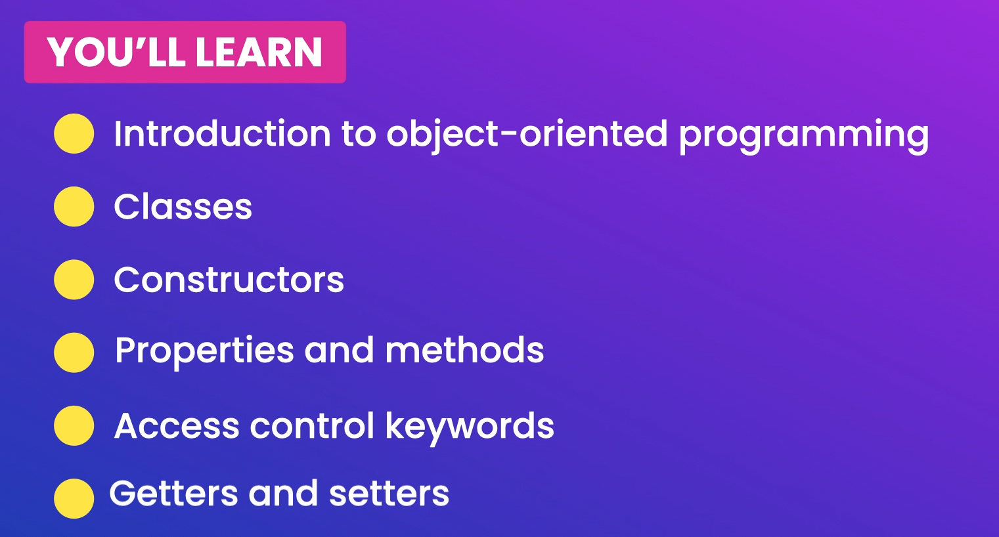
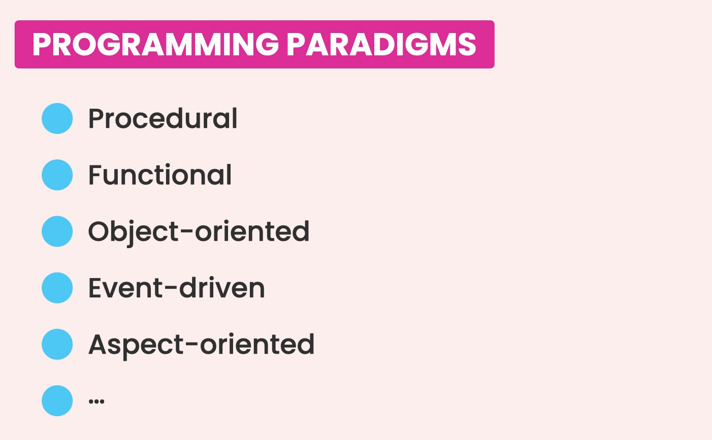
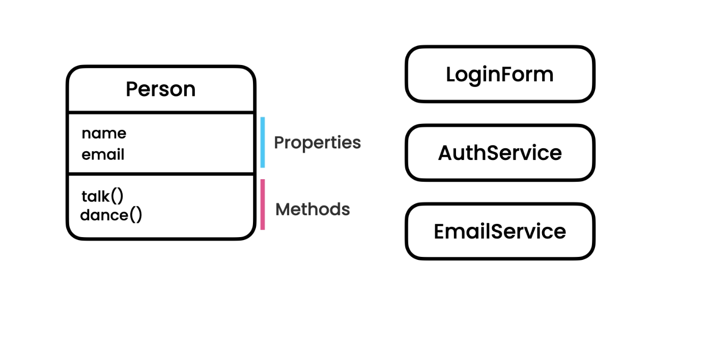
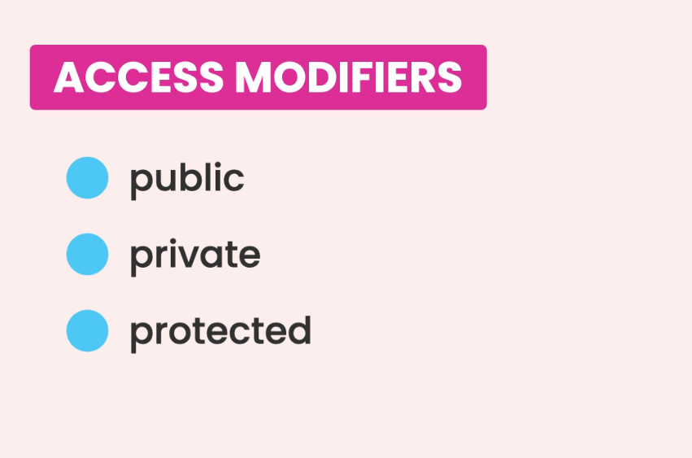
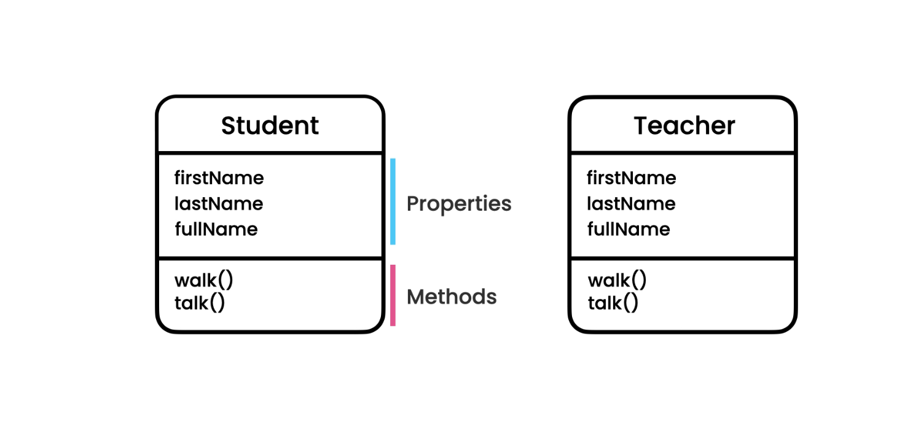
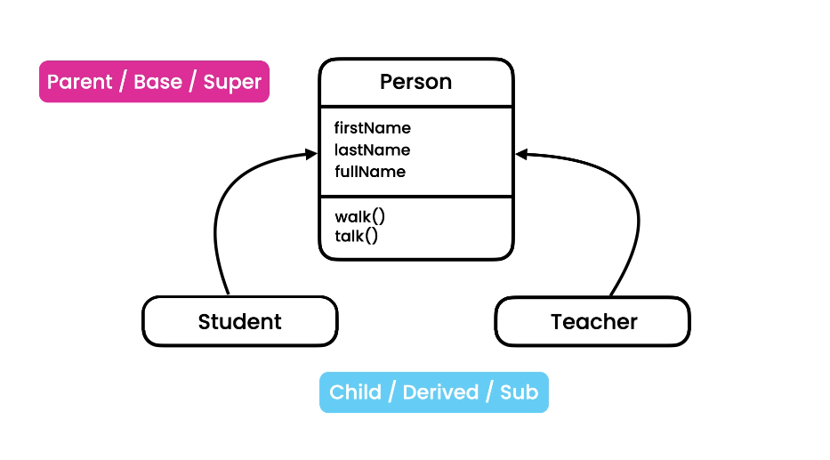
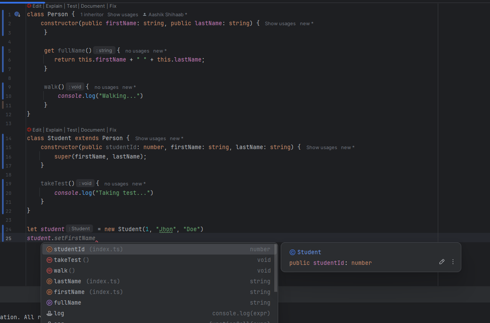
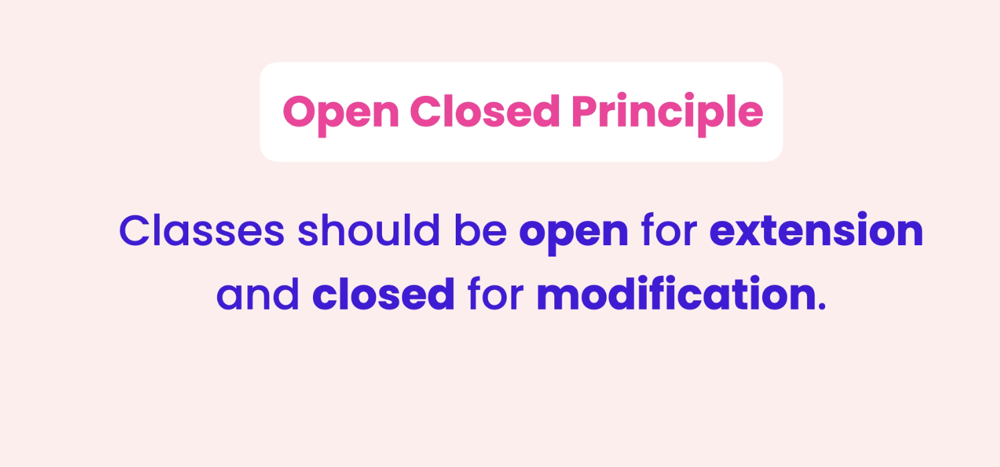
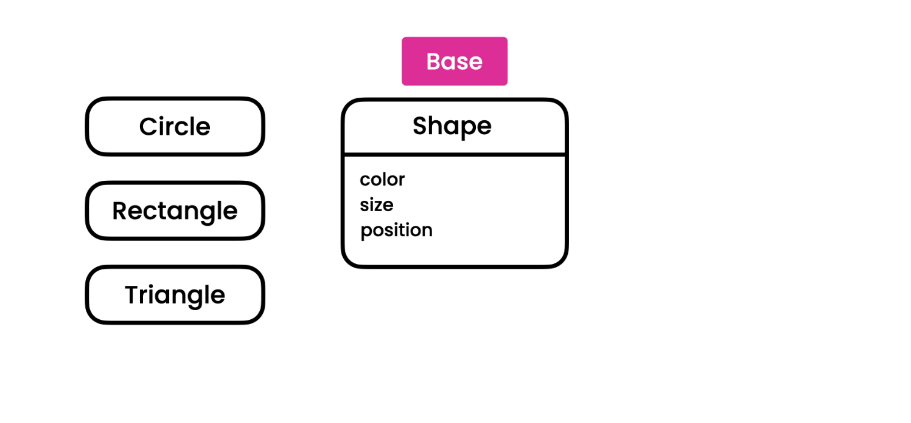

# Table of Contents
1. [Fundamentals](#fundamentals)
   1. [Build-in Types](#built-in-types)
   2. [Any Types](#any-types)
   3. [Arrays](#arrays)
   4. [Tuples](#tuples)
   5. [Enums](#enums)
   6. [Functions](#functions)
   7. [Objects](#objects)
2. [Advanced Types](#advanced-types)
   1. [Union Types](#union-types)
   2. [Intersection Types](#intersection-types)
   3. [Literal Types](#literal-types)
   4. [Nullable Types](#nullable-types)
   5. [Optional Types](#optional-types)
   6. [Nullish Coalescing Operator](#nullish-coalescing-operator)
   7. [Type Assertions](#type-assertions)
   8. [Unknown Types](#unknown-types)
   9. [Never Type](#never-type)
3. [Object Oriented Programming](#object-oriented-programming)
   1. [Classes](#classes)
   2. [Creating Objects](#creating-objects)
   3. [Read Only and Optional Properties](#read-only-and-optional-properties)
   4. [Access Modifiers](#access-modifiers)
   5. [Parameter Properties](#parameter-properties)
   6. [Getters and setters](#getters-and-setters)
   7. [Index Signatures](#index-signatures)
   8. [Static members](#static-members)
   9. [Inheritance](#inheritance)
   10. [Method overriding](#method-overriding)
   11. [Polymorphism](#polymorphism)
   12. [Open-Closed Principle](#open-closed-principle)
   13. [SOLID Principles](#solid-principles)
   14. [Private and Protected Members](#private-and-protected-members)
   

# TypeScript

TypeScript is built top on JavaScript.

In a nutshell, JavaScript with Type Checking.

Benefits

-   Static Typing
-   Code Completion
-   Refactoring
-   Shorthand notation

Drawbacks

-   Compilation
    -   ts -> compiler -> js
    -   (Transpilation)
-   Discipline in coding

TS = Medium to Large Projects
JS = Simple Projects

#### Installation

```bash
npm install -g typescript
```

#### Verify Installation

```bash
tsc -v
```

#### Config the typescript

```bash
tsc --init
```

**Ctrl + space --> Suggestions in the code.**

-   Useful when we use VS Code.
    -   Separate the source code and the compiled code.

```
"rootDir": "./src",                                  /* Specify the root folder within your source files. */
"outDir": "./dist",                                   /* Specify an output folder for all emitted files. */
"noEmitOnError": true,                            /* Disable emitting files if any type checking errors are reported. */ - Will not compile JS file if any error is there.
"removeComments": true,                           /* Disable emitting comments. */ -- rm comments from the compiled file.

```

```json
//Launch.json for debug for VSCode

"preLaunchTask" : "tsc: build - tsconfig.json"
"sourceMap": true /* Create source map files for emitted JavaScript files. */,

```

```typescript
let age: number = 10;
if (age < 50) age += 10;
console.log(age);

// Debug the console
```

-----

# Fundamentals


## Built-in Types


No need to infer the type of the variable. It will automatically infer the type of the variable.

```typescript
let sales = 123_456_789; // sales: number
let course = "TypeScript"; // course: string
let is_published = true; // is_published: boolean
```

### Any types

```typescript
let level;
level = "beginner";
level = 1;

// Actually it is not a good practice to use any type. it's almost against the purpose of using TypeScript.
```

```typescript
function render(doc: any) {
    console.log(doc);
}

// If you know what type of data you are going to get, then you can use any type. Otherwise it's not a good practice.
```

### Arrays

```typescript
let numbers: number[] = [1, 2, 3];
numbers[3] = "A"; // Error
```


### Tuples

```typescript
let person: [string, number] = ["John", 25];
```


Have only issue here. 
```typescript
let user: [number, string] = [10, 'Jane'];
user.push("A");

console.log(user);
```


Tuples are only used for key value pairs. Otherwise, it's not a good practice to use tuples. So avoid to use other than that.
```typescript
let user: [number, string, boolean, string] = [10, 'Jane', true, "Jon"];
```

### Enums

```typescript
// const small = 1;
// const medium = 2;
// const large = 3;

// enum Size { Small=  "s", Medium="m", Large="l" }

// PascalCase
enum Size { Small=  1, Medium, Large }

let mySize: Size = Size.Medium;
console.log(mySize); // 2
```


## Functions

- As a best practice, always specify the parameters and return type of the function.

```typescript

function calculateTax(income: number, taxYear = 2022): number{
    if (taxYear < 2022) {
        return income * 0.2;
    }
    return income * 0.3;
}

calculateTax(10_000);
```

```json
//Specially when functions

"noUnusedParameters": true,                       /* Raise an error when a function parameter isn't read. */
"noImplicitReturns": true,                        /* Enable error reporting for codepaths that do not explicitly return in a function. */
"noUnusedLocals": true,                           /* Enable error reporting when local variables aren't read. */

```

## Objects

```typescript

let employee : { 
    readonly id: number,
    name: string, 
    retire: (date: Date) => void 
} = {
    id: 1,
    name: "Aashik",
    retire: (date: Date)=> {
        console.log(date);
    }
}

employee.id = 0; // Error: Cannot assign to 'id' because it is a read-only property.

```

 Lots of issues here, we will talk about this in the next section.

  1. If we have to create another employee, we need to duplicate the object. so that's against DRy principle.
  2. Other emoployee Object can have other properties.
  3. Overrall structure is hard to readable.

Where we use type alias.


# Advanced Types


```typescript
type Employee = {
    readonly id: number,
    name: string,
    retire: (date: Date) => void
}

let employee : Employee = {
    id: 1,
    name: "Aashik",
    retire: (date: Date)=> {
        console.log(date);
    }
}
```

## Union Types

If we don't have a type of the variable, we can use union types and for use, typeof operator for separate cases called as Narrowing

Can see only the common properties of the union types.


```typescript
function kgToLbs(weight: number | string){
    // Narrowing
    if (typeof weight === "number")
        return weight * 2.2;
    else
        return parseInt(weight) * 2.2;
}

console.log(kgToLbs(70)) // 154
console.log(kgToLbs("50")) // 110

```

Union sets will not be there in the compiled JS file.
```js
function kgToLbs(weight) {
    if (typeof weight === "number")
        return weight * 2.2;
    else
        return parseInt(weight) * 2.2;
}
//# sourceMappingURL=index.js.map
```

## Intersection Types

```typescript
// let weight: number & string;

type draggable = {
    drag: () => void;
}

type resizable = {
    resize: () => void;
}

type UIWidget = draggable & resizable;

let textBox: UIWidget = {
    drag: ()=> {},
    resize: ()=> {}
}
```

## Literal Types
Literal types in TypeScript allow you to specify exact values a variable can hold. They can be used with strings, numbers, and boolean values. Literal types are useful for creating more precise and specific types

```typescript
// Literal (exact,specific)
type Quantity = 50 | 100;
let quantity: Quantity = 100;

type Metric = "cm" | "inch";
```

```typescript
// String Literal Type
type Direction = "up" | "down" | "left" | "right";

let move: Direction;
move = "up"; // valid
move = "down"; // valid
move = "north"; // Error: Type '"north"' is not assignable to type 'Direction'.

// Number Literal Type
type OneToFive = 1 | 2 | 3 | 4 | 5;

let rating: OneToFive;
rating = 3; // valid
rating = 6; // Error: Type '6' is not assignable to type 'OneToFive'.

// Boolean Literal Type
type YesOrNo = true | false;

let isAvailable: YesOrNo;
isAvailable = true; // valid
isAvailable = false; // valid
isAvailable = "yes"; // Error: Type '"yes"' is not assignable to type 'YesOrNo'.
```

##  Nullable Types

Nullable types in TypeScript allow you to specify that a variable can hold a value of a certain type or be null or undefined. This is useful for handling cases where a value might not be present.  

```typescript

function greet(name: string | null | undefined){
    if (name)
        console.log(name.toUpperCase())
    else
        console.log('Hola!')
}

greet('Aashik'); // Output: AASHIK
greet(null);     // Output: Hola!
greet(undefined); // Output: Hola!
```

## Optional Types

Optional checking in TypeScript allows you to specify that a property or parameter is optional. This is useful for handling cases where a value might not be provided.

```typescript
type Customer = {
    birthday?: Date;
}

function getCustomer(id: number): Customer | null {
    return  (id === 0 ? null : { birthday : new Date()})
}

let customer = getCustomer(1);
// Optional Property access operator
console.log(customer?.birthday?.getFullYear())

// Optional element access operator
// customer?.[0]

// Optional call for function
let log: any = null;
log?.('Hello World')
```

**Optional Properties**

You can define optional properties in an interface or type by using the ? symbol.

```typescript
interface User {
    id: number;
    name?: string; // name is optional
}

let user1: User = { id: 1 };
let user2: User = { id: 2, name: "Aashik" };
```

**Optional Parameters**

You can define optional parameters in a function by using the ? symbol.

```typescript
function greet(name?: string) {
    if (name) {
        console.log(`Hello, ${name.toUpperCase()}!`);
    } else {
        console.log('Hello!');
    }
}

greet(); // Output: Hello!
greet('Aashik'); // Output: Hello, AASHIK!
```

## Nullish Coalescing Operator

The nullish coalescing operator (??) in TypeScript is used to provide a default value when dealing with null or undefined. It is useful for handling cases where a value might be missing and you want to ensure a fallback value is used instead.

Ex1:
```typescript
let userInput: string | null = null;
let defaultText: string = "Default text";

let text = userInput ?? defaultText;
console.log(text); // Output: Default text
```

In this example, userInput is null, so the nullish coalescing operator (??) returns defaultText. If userInput were any value other than null or undefined, it would be used instead


Ex 2: 
```typescript
let speed: number | null = null;
let ride = {
    // Falsy (undefined, null, '', false, 0)
    // speed: speed ==! null ? speed : 30, // P1 --> better way to write this is using the nullish coalescing operator
    // Nullish coalescing operator (if speed is undefined or null -> 30)
    speed: speed ?? 30,
}
```

## Type Assertions

Type assertions in TypeScript allow you to override the inferred type of a variable. This is useful when you know more about the type of a value than TypeScript does. Type assertions do not perform any runtime checks or conversions; they simply tell the compiler to treat a value as a specific type.

**Syntax**

There are two ways to use type assertions:

1. Angle-bracket syntax:  
    ```
   let someValue: any = "this is a string";
   let strLength: number = (<string>someValue).length;
   ```
2. as syntax:  
   ```
   let someValue: any = "this is a string";
   let strLength: number = (someValue as string).length;
   ```

Ex:1
```typescript
interface Employee {
    name: string;
    code: number;
}

let employee = {} as Employee;
employee.name = "John";
employee.code = 123;
```

In this example, the employee object is initially an empty object, but it is asserted to be of type Employee. This allows you to assign properties name and code to it without TypeScript raising an error.


Ex2:
```typescript
// m1
let phone = document.getElementById('phone') as HTMLInputElement;
phone.value
// m2
let phone2 = <HTMLInputElement> document.getElementById('phone');

// It's like I tell I know more than you about this. So, I'm going to tell you what type it is.
```

## Unknown Types

The unknown type in TypeScript is a type-safe counterpart to the any type. It represents any value but requires you to perform type checking before performing operations on it. This makes it safer than any because it forces you to ensure the type is correct before using it.

```typescript
let value: unknown;

value = "Hello";
value = 42;
value = true;

// We have to narrow down to a specific  
// type before we can perform any operations 
// on an unknown type.

// Type checking is required before using the value
if (typeof value === "string") {
    console.log(value.toUpperCase()); // Safe to use as a string
}

if (typeof value === "number") {
    console.log(value.toFixed(2)); // Safe to use as a number
}
```

In this example, the variable value can hold any type, but you must check its type before performing operations on it. This ensures type safety and prevents runtime errors.

```typescript
function render(document: unknown){
    document.move();
    document.fly();
    document.whateverWeWant();
}

// No error will shown if we put an any type.
//  It will raise issue for unknown. So, we need to check the type before using it. better than any.
```

## Never Type

The never type in TypeScript represents values that never occur. It is used to indicate that a function never returns or always throws an error. This type is useful for functions that have unreachable endpoints or for exhaustive type checking in switch statements.

**Example**

1. Function that never returns:

```typescript
function throwError(message: string): never {
    throw new Error(message);
}
```

2. Function with an infinite loop:

```typescript
function infiniteLoop(): never {
    while (true) {
        // Infinite loop
    }
}
```

In this example, the infiniteLoop function never terminates, so its return type is never.

**Exhaustive type checking:**

```typescript
type Shape = 'circle' | 'square';

function getArea(shape: Shape): number {
    switch (shape) {
        case 'circle':
            return Math.PI * 1 * 1; // Example area calculation
        case 'square':
            return 1 * 1; // Example area calculation
        default:
            const _exhaustiveCheck: never = shape;
            throw new Error(`Unhandled case: ${_exhaustiveCheck}`);
    }
}
```

In this example, the default case in the switch statement uses the never type to ensure all possible cases of the Shape type are handled. If a new shape is added to the Shape type, TypeScript will raise an error if it is not handled in the switch statement.

Ex2: 
```typescript
function reject(message: string) : never {
    throw new Error(message);
}

function processEvents(): never{
    while (true){
        // Read a message from the queue
    }
}

// processEvents();
reject("...")
console.log("Hello, world!");

// Indicate error for log.. Not gona reach
// "allowUnreachableCode": false,                     /* Disable error reporting for unreachable code. */

```
-----

**Exercises**

```typescript
type user = {
    name: string,
    age: number,
    occupation?: string
}
// --
let users : user[] = [
    {
        name: 'John Smith',
        age: 30,
        occupation: 'Software engineer'
    },
    {
        name: 'Kate Müller',
        age: 28
    }
];
```


```typescript
let user = getUser();
console.log(user && user.address ? user.address.street : undefined);

// Narrow
console.log(user?.address?.street);

/*
* user?.address?.street: The optional chaining operator (?.) ensures that the code will safely attempt to access address and street only if user and address exist.
?? undefined: The nullish coalescing operator ensures that if the value is null or undefined, it explicitly returns undefined.
In this case, ?? undefined is redundant because if user?.address?.street is undefined, it will already print as undefined. So, the even simpler version is:
* */


let x = foo !== null && foo !== undefined ? foo : bar();
// Narrow
let x = foo ?? bar();
```


```typescript
let value: unknown = 'a'; 
if (typeof value === 'string') // This line need to be here
    console.log(value.toUpperCase()); 

```

----


# Object Oriented Programming 




Ways of writing code


## Classes


- Class is a blueprint for creating objects.
- Class Naming Convention: PascalCase
- Constructor is always return instance of the class.

```typescript
class Account {
    // define properties
    id: number;
    name: string;
    balance: number;

    // define constructor
    constructor(id: number,name: string, balance: number) {
        this.id = id;
        this.name = name;
        this.balance = balance;
    }

    // define method
    deposit(amount: number): void {
        if ( amount < 0 )
            throw new Error ("Invalid amount");
        this.balance += amount;
    }
}
```

```js
class Account {
    constructor(id, name, balance) {
        this.id = id;
        this.name = name;
        this.balance = balance;
    }
    deposit(amount) {
        if (amount < 0)
            throw new Error("Invalid amount");
        this.balance += amount;
    }
}
//# sourceMappingURL=index.js.map
```

## Creating Objects

```typescript
let account  = new Account(1, "Aashik", 0)
account.deposit(100);

console.log(account.balance) // 100
console.log(typeof account); // object

console.log(account) // Object
// Check if the object is an instance of the class
console.log(account instanceof Account); // true
```

## Read Only and Optional Properties

In the bank account, we cannot change the id of the account. It will make the bug in the function.
SO, have to put readonly, we provide nickname as new property and put as optional.

```ts
class Account {
    readonly id: number;
    name: string;
    balance: number;
    nickname?: string

    constructor(id: number,name: string, balance: number) {
        this.id = id;
        this.name = name;
        this.balance = balance;
    }

    deposit(amount: number): void {
        // account.id = 2; // Error: Cannot assign to 'id' because it is a read-only property
        if ( amount < 0 )
            throw new Error ("Invalid amount");
        this.balance += amount;
    }
}

let account  = new Account(1, "Aashik", 0)
account.deposit(100);

console.log(account.balance) // 100
console.log(typeof account); // object


```

## Access Modifiers



So I need to record a transaction, when I put the amount in the account.


```ts
class Account {
    readonly id: number;
    name: string;
    private _balance: number;
    nickname?: string

    constructor(id: number,name: string, balance: number) {
        this.id = id;
        this.name = name;
        this._balance = balance;
    }

    deposit(amount: number): void {
        // account.id = 2; // Error: Cannot assign to 'id' because it is a read-only property
        if ( amount < 0 )
            throw new Error ("Invalid amount");
        this._balance += amount;
    }
    
    // gonna use this within class. not outside
    private calculateTax(){

    }
    
    getBalance(): number{
        return this._balance;
    }
}

let account  = new Account(1, "Aashik", 0)
account.deposit(100);
console.log(account.getBalance()); // 100

```


## Parameter Properties

Parameter properties in TypeScript provide a shorthand way to declare and initialize class properties directly in the constructor parameters. This reduces boilerplate code and makes the class definition more concise.

In this example, the **Account** class uses parameter properties to declare and initialize id, name, _balance, and nickname directly in the constructor. This eliminates the need to separately declare these properties and assign them in the constructor body.

```ts
class Account {
    constructor(public readonly id: number,
                public name: string,
                private _balance: number,
                public nickname?: string) {
    }


    deposit(amount: number): void {
        if ( amount < 0 ) throw new Error ("Invalid amount");
        this._balance += amount;
    }

    getBalance(): number{
        return this._balance;
    }
}

const account = new Account(1, "John", 100, "Doe");
```

## Getters and setters

Getters and setters in TypeScript are special methods that provide a way to access and update the properties of a class. They allow you to control how a property is accessed and modified, adding encapsulation and validation logic.

Instead of using getBalance() method, we can use getter and setter.

```ts
class Account {

    constructor(public readonly id: number, public name: string,private _balance: number) {
    }

    // Getter for balance
    get balance():number  {
        return this._balance;
    }

    // Setter for balance
    set balance(value: number){
        if (value < 0) throw new Error("Invalid balance");
        this._balance = value;
    }

    deposit(amount: number): void {
        if (amount < 0) {
            throw new Error("Invalid amount");
        }
        this._balance += amount;
    }
}

let account = new Account(1, "Aashik", 100);
console.log(account.balance); // 100

account.deposit(50);
console.log(account.balance); // 150

account.balance = 200;
console.log(account.balance); // 200

// account.balance = -50; // Error: Invalid amount
```

## Index Signatures

Index signature properties in TypeScript allow you to define properties with dynamic keys. This is useful when you don't know the exact property names ahead of time but you know the type of the values

```ts
// let person = {
// }
// person.name = "Aashik";
// console.log(person)

class SeatAssignment {
    // A1, A2, ....
    // Mosh, Jhon, ...
    // A1: string,
    // Index Signature Property
    [seatNumber: string] : string
}

let seats = new SeatAssignment();
seats.A1 = "Mosh"
// seats[A1] = "Mosh"
// seats.A2 = 1; // Error - Type 'number' is not assignable to type 'string'.
seats.A2 = "Jhon";

console.log(seats)

```

## Static members

Static members in TypeScript are properties and methods of a class that belong to the class itself rather than to instances of the class. They are accessed using the class name rather than an instance of the class.

Ex1:
```ts
class MathUtil {
    // Static property
    static PI: number = 3.14;

    // Static method
    static calculateCircumference(radius: number): number {
        return 2 * MathUtil.PI * radius;
    }
}

// Accessing static property
console.log(MathUtil.PI); // 3.14

// Calling static method
console.log(MathUtil.calculateCircumference(10)); // 62.8
```

In this example, PI is a static property and calculateCircumference is a static method. They are accessed using the class name MathUtil rather than an instance of the class.

Ex2:
```ts
class Ride {
    activeRides: number = 0;

    start(){this.activeRides++;}
    stop(){this.activeRides--;}
}

let ride1 = new Ride();
ride1.start();

let ride2 = new Ride();
ride2.start();

console.log(ride1.activeRides); // 
console.log(ride2.activeRides); //

// But here we need 2 right, so we need to make activeRides as static.


```
--

```ts
class Ride {
    private static _activeRides: number = 0;

    start(){Ride._activeRides++;}
    stop(){Ride._activeRides--;}

    static get activeRides(){
        return Ride._activeRides;
    }
}

// This is can't be happen logically. so we need to make it private.
// Ride._activeRides = 10;

let ride1 = new Ride();
ride1.start();

let ride2 = new Ride();
ride2.start();

console.log(Ride.activeRides); //


```

## Inheritance

Inheritance in TypeScript allows you to create a new class (derived class) based on an existing class (base class). The derived class inherits properties and methods from the base class, allowing you to reuse code and create a hierarchy of classes.

- We dont want to create two separate clases that have same properties and methods. So, we can use inheritance.




```ts
class Person {
    constructor(public firstName: string, public lastName: string) {
    }

    get fullName() {
        return this.firstName + " " + this.lastName;
    }

    walk() {
        console.log("Walking");
    }
}

class Student extends Person {
    constructor(public studentId: number, firstName: string, lastName: string) {
        super(firstName, lastName);
    }
    
    takeTest() {
        console.log("Taking a test");
    }
}
```

We dont need to define again like `public firstName: string, public lastName: string` in the Student class. We can use the super keyword to call the constructor of the base class.
Just need to add `firstName and lastName` in the constructor.




## Method overriding

```ts
class Person {
    constructor(public firstName: string, public lastName: string) {
     }

     get fullName(){
        return this.firstName + " " + this.lastName;
     }

     walk(){
         console.log("Walking...")
     }
}

class Student extends Person {
    constructor(public studentId: number, firstName: string, lastName: string) {
        super(firstName, lastName);
    }

    takeTest(){
        console.log("Taking test...")
    }
}

class Teacher extends Person {
    override get fullName(){
        // We don't need this.firstName + " " + this.lastName; since we already have in base class
        // return "Professor" + this.firstName + " " + this.lastName;
        // it will work without override too. but there is a minor issue with that.
        return "Professor " + super.fullName;
    }
}

let teacher = new Teacher("John", "Doe");
console.log(teacher.fullName)

```

         "noImplicitOverride": true,                       /* Ensure overriding members in derived classes are marked with an override modifier. */


## Polymorphism
// Many forms -  Object can take many different forms

Polymorphism in TypeScript allows you to use a single interface or base class to represent multiple derived classes. This enables you to write code that works with objects of different types without knowing the specific type at compile time.

```ts
class Person {
    constructor(public firstName: string, public lastName: string) {
     }

     get fullName(){
        return this.firstName + " " + this.lastName;
     }

     walk(){
         console.log("Walking...")
     }
}

class Student extends Person {
    constructor(public studentId: number, firstName: string, lastName: string) {
        super(firstName, lastName);
    }

    takeTest(){
        console.log("Taking test...")
    }
}

class Teacher extends Person {
    override get fullName(){
        return "Professor " + super.fullName;
    }
}

class Principal extends Person {
    override get fullName(){
        return "Principal " + super.fullName;
    }
}

printNames([
    new Student(1, "John", "Doe"),
    new Teacher("Mosh", "Hamedani"),
    new Principal("Adam", "Smith")
])

function printNames(people: Person[]){
    for (let person of people)
        console.log(person.fullName);
}

// here the person is Person class type, so it can be Student or Teacher or principals. This is how polymorphism works here.
```

Polymorphism allows objects of different classes to be treated as objects of a common base class. In this example, Student, Teacher, and Principal all extend the Person class. The printNames function accepts an array of Person objects, but it can handle Student, Teacher, and Principal objects because they all inherit from Person.  When printNames is called, it iterates over the array of Person objects and calls the fullName getter on each one. Due to polymorphism, the correct fullName method is called based on the actual type of the object (i.e., Student, Teacher, or Principal), even though the function only knows that it is dealing with Person objects

- new Student(1, "John", "Doe") creates a Student object.
- new Teacher("Mosh", "Hamedani") creates a Teacher object.
- new Principal("Adam", "Smith") creates a Principal object.

The printNames function treats all these objects as Person objects and calls their fullName method, demonstrating polymorphism

Without changing this, we are adding new classes. By this we achieve Open-Closed Principle.

```ts
function printNames(people: Person[]){
    for (let person of people)
        console.log(person.fullName);
}
```



## Open-Closed Principle

The Open-Closed Principle (OCP) is one of the five SOLID principles of object-oriented design. It states that software entities (such as classes, modules, and functions) should be open for extension but closed for modification. This means that the behavior of a module can be extended without modifying its source code.

### Key Points:
- **Open for Extension**: You should be able to add new functionality to a class or module.
- **Closed for Modification**: You should not change the existing code of a class or module.

### Benefits:
- **Maintainability**: Reduces the risk of introducing bugs when adding new features.
- **Scalability**: Makes it easier to extend the system with new functionality.
- **Flexibility**: Encourages the use of interfaces and abstract classes to allow for flexible and reusable code.

### Example:

Consider a `Person` class and its subclasses `Student`, `Teacher`, and `Principal`. The `printNames` function demonstrates the Open-Closed Principle by allowing new types of `Person` to be added without modifying the function itself.

```typescript
class Person {
    constructor(public firstName: string, public lastName: string) {}

    get fullName(): string {
        return this.firstName + " " + this.lastName;
    }
}

class Student extends Person {
    constructor(public studentId: number, firstName: string, lastName: string) {
        super(firstName, lastName);
    }
}

class Teacher extends Person {
    override get fullName(): string {
        return "Professor " + super.fullName;
    }
}

class Principal extends Person {
    override get fullName(): string {
        return "Principal " + super.fullName;
    }
}

function printNames(people: Person[]): void {
    for (let person of people) {
        console.log(person.fullName);
    }
}

printNames([
    new Student(1, "John", "Doe"),
    new Teacher("Mosh", "Hamedani"),
    new Principal("Adam", "Smith")
]);
```

In this example, the `printNames` function can handle new subclasses of `Person` without any changes, adhering to the Open-Closed Principle.

**SO, THE TAKEAWAY IS POLYMORPHISM IS ALLOW US TO FOLLOW THIS(open/close) GUIDELINE.**

## SOLID Principles

The SOLID principles are a set of five design principles in object-oriented programming that help developers create more maintainable, understandable, and flexible software. These principles were introduced by Robert C. Martin, also known as Uncle Bob.

### S - Single Responsibility Principle (SRP)
A class should have only one reason to change, meaning it should have only one job or responsibility.

### O - Open/Closed Principle (OCP)
Software entities (classes, modules, functions, etc.) should be open for extension but closed for modification. This means you should be able to add new functionality without changing existing code.

### L - Liskov Substitution Principle (LSP)
Objects of a superclass should be replaceable with objects of a subclass without affecting the correctness of the program. Subtypes must be substitutable for their base types.

### I - Interface Segregation Principle (ISP)
Clients should not be forced to depend on interfaces they do not use. Instead of one large interface, many small, specific interfaces are preferred.

### D - Dependency Inversion Principle (DIP)
High-level modules should not depend on low-level modules. Both should depend on abstractions. Abstractions should not depend on details. Details should depend on abstractions.

### Benefits of SOLID Principles
- **Maintainability**: Easier to maintain and understand the code.
- **Scalability**: Facilitates adding new features without breaking existing functionality.
- **Flexibility**: Encourages the use of interfaces and abstract classes for more flexible and reusable code.
- **Testability**: Improves the ability to test code by promoting loose coupling and high cohesion.

### Example


### Single Responsibility Principle (SRP)

A class should have only one reason to change, meaning it should have only one job or responsibility.

```typescript
class User {
    constructor(public name: string, public email: string) {}
}

class UserRepository {
    private users: User[] = [];

    addUser(user: User) {
        this.users.push(user);
    }

    getUser(email: string): User | undefined {
        return this.users.find(user => user.email === email);
    }
}

class UserService {
    constructor(private userRepository: UserRepository) {}

    registerUser(name: string, email: string) {
        const user = new User(name, email);
        this.userRepository.addUser(user);
    }
}
```

### Open/Closed Principle:

```typescript
class Person {
    constructor(public firstName: string, public lastName: string) {}

    get fullName(): string {
        return this.firstName + " " + this.lastName;
    }
}

class Student extends Person {
    constructor(public studentId: number, firstName: string, lastName: string) {
        super(firstName, lastName);
    }
}

class Teacher extends Person {
    override get fullName(): string {
        return "Professor " + super.fullName;
    }
}

class Principal extends Person {
    override get fullName(): string {
        return "Principal " + super.fullName;
    }
}

function printNames(people: Person[]): void {
    for (let person of people) {
        console.log(person.fullName);
    }
}

printNames([
    new Student(1, "John", "Doe"),
    new Teacher("Mosh", "Hamedani"),
    new Principal("Adam", "Smith")
]);
```

In this example, the `printNames` function can handle new subclasses of `Person` without any changes, adhering to the Open/Closed Principle.


### Liskov Substitution Principle (LSP)

Objects of a superclass should be replaceable with objects of a subclass without affecting the correctness of the program.

```typescript
class Bird {
    fly() {
        console.log("Flying");
    }
}

class Duck extends Bird {
    quack() {
        console.log("Quacking");
    }
}

class Penguin extends Bird {
    fly() {
        throw new Error("Penguins can't fly");
    }

    swim() {
        console.log("Swimming");
    }
}

function makeBirdFly(bird: Bird) {
    bird.fly();
}

makeBirdFly(new Duck()); // Works fine
makeBirdFly(new Penguin()); // Throws error
```

### Interface Segregation Principle (ISP)

Clients should not be forced to depend on interfaces they do not use. Instead of one large interface, many small, specific interfaces are preferred.

```typescript
interface Printer {
    print(document: string): void;
}

interface Scanner {
    scan(document: string): void;
}

class AllInOnePrinter implements Printer, Scanner {
    print(document: string) {
        console.log("Printing: " + document);
    }

    scan(document: string) {
        console.log("Scanning: " + document);
    }
}

class SimplePrinter implements Printer {
    print(document: string) {
        console.log("Printing: " + document);
    }
}
```

### Dependency Inversion Principle (DIP)

High-level modules should not depend on low-level modules. Both should depend on abstractions. Abstractions should not depend on details. Details should depend on abstractions.

```typescript
interface Database {
    save(data: string): void;
}

class MySQLDatabase implements Database {
    save(data: string) {
        console.log("Saving data to MySQL database: " + data);
    }
}

class UserService {
    constructor(private database: Database) {}

    saveUser(data: string) {
        this.database.save(data);
    }
}

const database = new MySQLDatabase();
const userService = new UserService(database);
userService.saveUser("User data");
```

## Private vs Protected Members

Private is not inherited. Meanwhile, protected is inherited.

```ts
class Person {
    constructor(public firstName: string, public lastName: string) {
     }

     get fullName(){
        return this.firstName + " " + this.lastName;
     }

     protected walk(){
         console.log("Walking...")
     }
}

class Student extends Person {
    constructor(public studentId: number, firstName: string, lastName: string) {
        super(firstName, lastName);
    }
    
    takeTest(){
        this.walk(); // we can call walk here. but if we use private in walk, we cannot access it.
        // use private when you know what you are doing exactly.
        console.log("Taking test...")
    }
}


```

## Abstract classes and methods



Abstract classes in TypeScript are used to define a base class that cannot be instantiated directly. They are useful for creating a common blueprint for derived classes, ensuring that certain methods and properties are implemented by all subclasses.

### Key Points:
- **Cannot be instantiated**: Abstract classes cannot be instantiated directly.
- **Common blueprint**: They provide a common structure for derived classes.
- **Abstract methods**: They can contain abstract methods that must be implemented by derived classes.

### Example:

```typescript
abstract class Animal {
    constructor(public name: string) {}

    abstract makeSound(): void;

    move(): void {
        console.log(`${this.name} is moving.`);
    }
}

class Dog extends Animal {
    makeSound(): void {
        console.log("Bark");
    }
}

class Cat extends Animal {
    makeSound(): void {
        console.log("Meow");
    }
}

// For this function, we create an abstract class
const animal = new Animal(); // Error: Cannot create an instance of an abstract class.
animal.move(); // Error: Cannot create an instance of an abstract class.

const dog = new Dog("Buddy");
dog.makeSound(); // Bark
dog.move(); // Buddy is moving.

const cat = new Cat("Whiskers");
cat.makeSound(); // Meow
cat.move(); // Whiskers is moving.
```

In this example, `Animal` is an abstract class with an abstract method `makeSound`. The `Dog` and `Cat` classes extend `Animal` and provide their own implementations of the `makeSound` method. This ensures that all subclasses of `Animal` implement the `makeSound` method, providing a consistent interface.

Ex2:

```ts
abstract class Shape {
    constructor(public color: string) {
    }

    // render the shape
    abstract render(): void;
}

class Circle extends Shape {
    constructor(public radius: number, color: string) {
        super(color);
    }

    override render(): void {
        console.log("Rendering Circle...");
    }
}

const circle = new Circle(10, "red")
console.log(circle)
```

## Interfaces

Classes - Blueprint for creating objects

Interfaces - to define the shape of objects

Interfaces in TypeScript are used to define the shape of an object. They specify the properties and methods that an object must have, but do not provide implementations. Interfaces are a way to enforce a contract on a class or an object, ensuring that it adheres to a specific structure.

### Key Points:
- **Type Checking**: Interfaces are used for type checking at compile time.
- **No Implementation**: Interfaces do not contain any implementation.
- **Optional Properties**: Properties can be marked as optional using the `?` symbol.
- **Readonly Properties**: Properties can be marked as readonly using the `readonly` keyword.
- **Extending Interfaces**: Interfaces can extend other interfaces, allowing for the creation of complex types.

### Example:

```typescript
interface Person {
    firstName: string;
    lastName: string;
    age?: number; // Optional property
    readonly id: number; // Readonly property
    getFullName(): string;
}

class Student implements Person {
    constructor(
        public firstName: string,
        public lastName: string,
        public id: number,
        public age?: number
    ) {}

    getFullName(): string {
        return `${this.firstName} ${this.lastName}`;
    }
}

const student: Person = new Student("John", "Doe", 1, 20);
console.log(student.getFullName()); // John Doe
```

In this example, the `Person` interface defines the structure that a `Person` object must have. The `Student` class implements the `Person` interface, ensuring that it has all the properties and methods defined in the interface.

```ts
// abstract class Calender{
//     constructor(public name: string) {
//     }
//
//     abstract addEvent(): void;
//     abstract removeEvent(): void;
// }

// More clean and concise
interface Calender {
    name: string;
    addEvent(): void;
    removeEvent(): void;
}

interface CloudCalender extends Calender {
    sync(): void;
}

class GoogleCalender implements Calender {
   constructor(public name: string){}

    addEvent(): void {
    }

    removeEvent(): void {
    }

}

// Using an interface is more flexible than using an abstract class, and that's shape of an object.
```


## Interface vs Abstract class

### Interface
- **Purpose**: Defines a contract that classes can implement.
- **Implementation**: Cannot provide any implementation, only method signatures and properties.
- **Multiple Inheritance**: A class can implement multiple interfaces.
- **Usage**: Used to define the shape of an object or to enforce a contract on a class.

```typescript
interface Person {
    firstName: string;
    lastName: string;
    getFullName(): string;
}

class Student implements Person {
    constructor(public firstName: string, public lastName: string) {}

    getFullName(): string {
        return `${this.firstName} ${this.lastName}`;
    }
}
```

### Abstract Class
- **Purpose**: Serves as a base class that cannot be instantiated directly.
- **Implementation**: Can provide both method signatures and implementations.
- **Single Inheritance**: A class can extend only one abstract class.
- **Usage**: Used to define a common blueprint for derived classes, ensuring certain methods and properties are implemented.

```typescript
abstract class Animal {
    constructor(public name: string) {}

    abstract makeSound(): void;

    move(): void {
        console.log(`${this.name} is moving.`);
    }
}

class Dog extends Animal {
    makeSound(): void {
        console.log("Bark");
    }
}
```

### Key Differences
- **Interfaces** cannot have any implementation, while **abstract classes** can have both abstract methods (without implementation) and concrete methods (with implementation).
- A class can implement multiple **interfaces**, but it can extend only one **abstract class**.
- **Interfaces** are used to define the shape of an object, while **abstract classes** are used to provide a common base class with shared functionality.

## Interfaces vs Types

In TypeScript, interfaces and type aliases can be used interchangeably.

Both can be used to describe the shape of an object:

Interface

```ts
interface Person {
    name: string;
}

let person: Person = {
    name: 'Mosh',
};
```

Type
```ts

type Person = {
    name: string;
};

let person: Person = {
    name: 'Mosh',
};
```

A class can also implement an interface or a type alias:

```ts
class MyCalendar extends MyInterface {}  
class MyCalendar extends MyType {}
```
It’s more conventional to use an interface in front of the extends keyword, though. 


## Exercises

```ts
class Logger {
    constructor(public logFile: string) {
    }
    
    log(message: string){
    }
}

class Person {
    constructor(public firstName: string, public lastName: string) {
    }
    
    get fullName(){
        return `${this.firstName} ${this.lastName}`;
    }
}

class Employee extends Person{
    constructor(public salary: number, firstName:string, lastName:string) {
        super(firstName, lastName);
    }
}

// Protected can be inherited by child classes but not private.

interface Employee {
    name: string;
    salary: number;
    address: Address
}

interface Address {
    street: string;
    city: string;
    zipCode: number;
    
}
```


# Generics